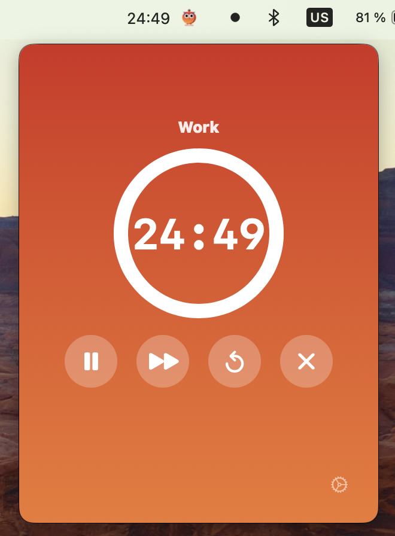
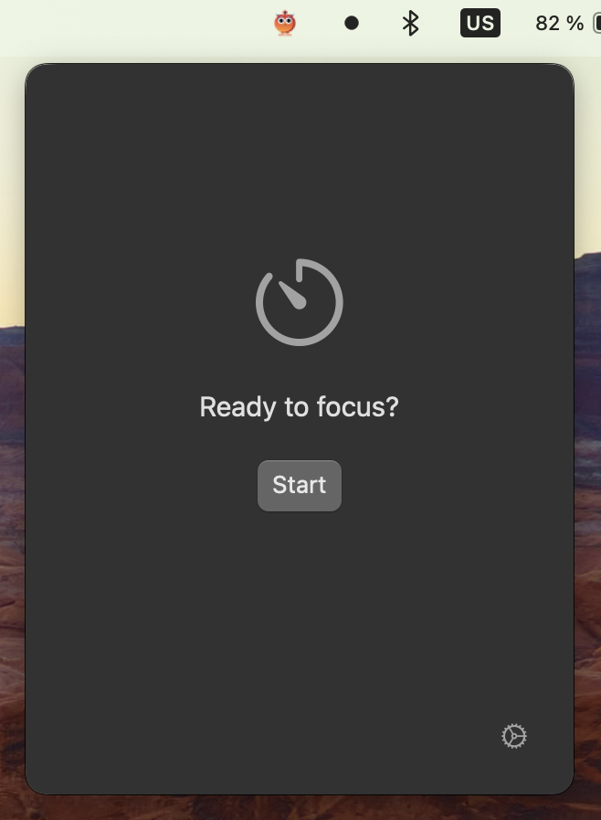
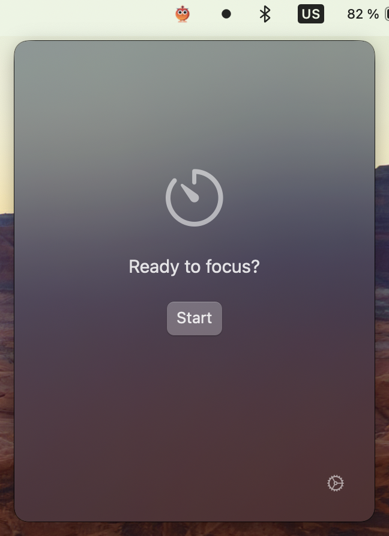
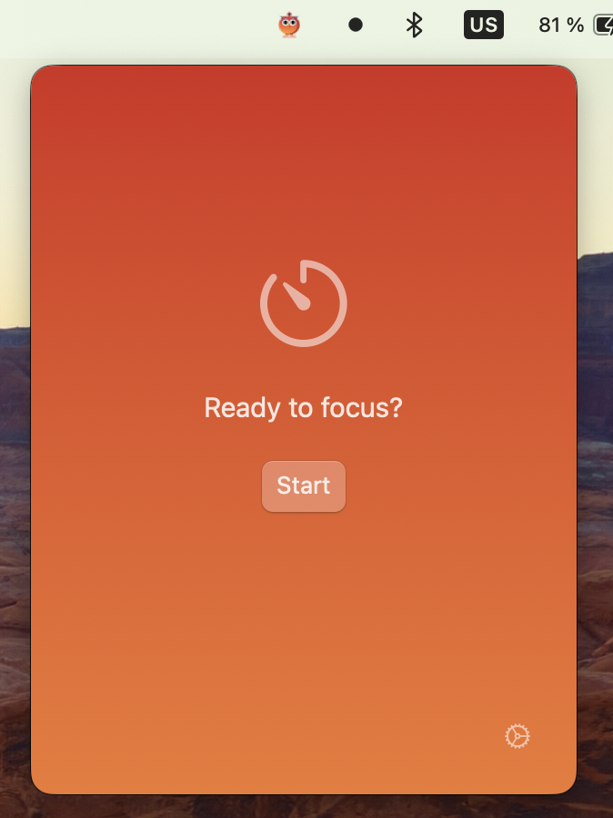
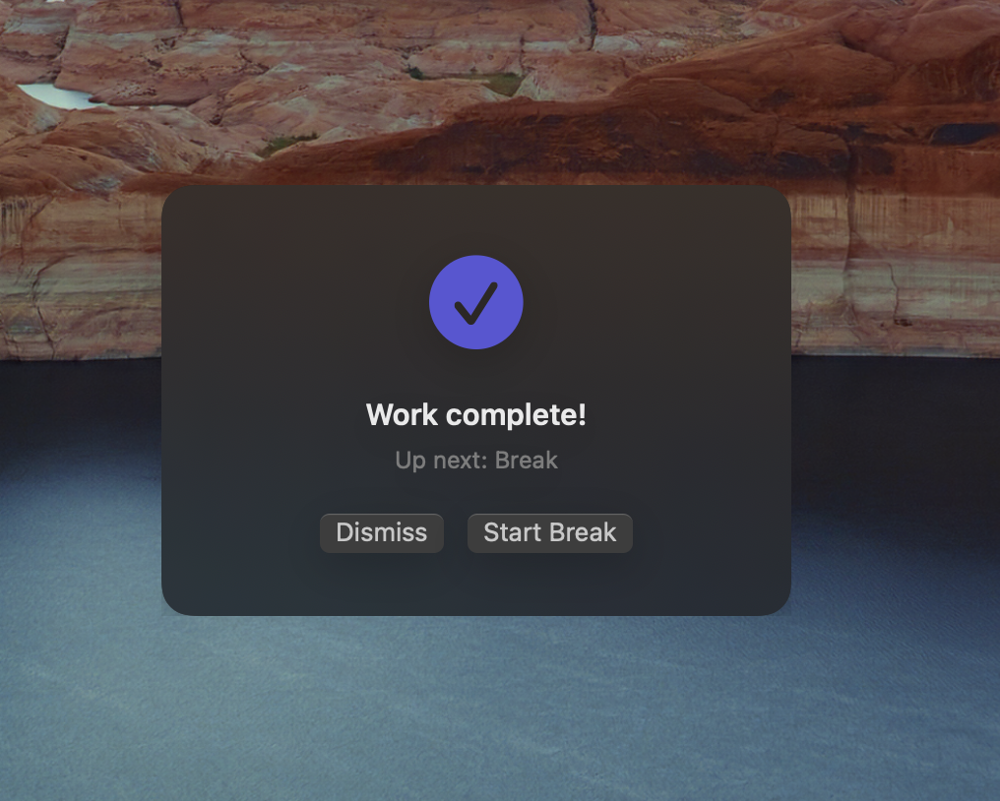
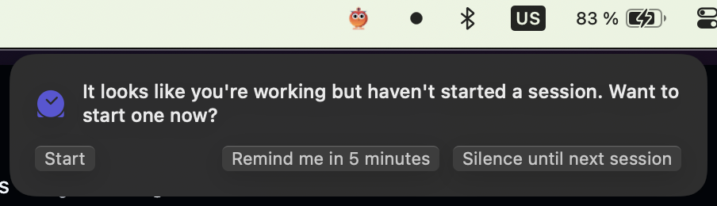
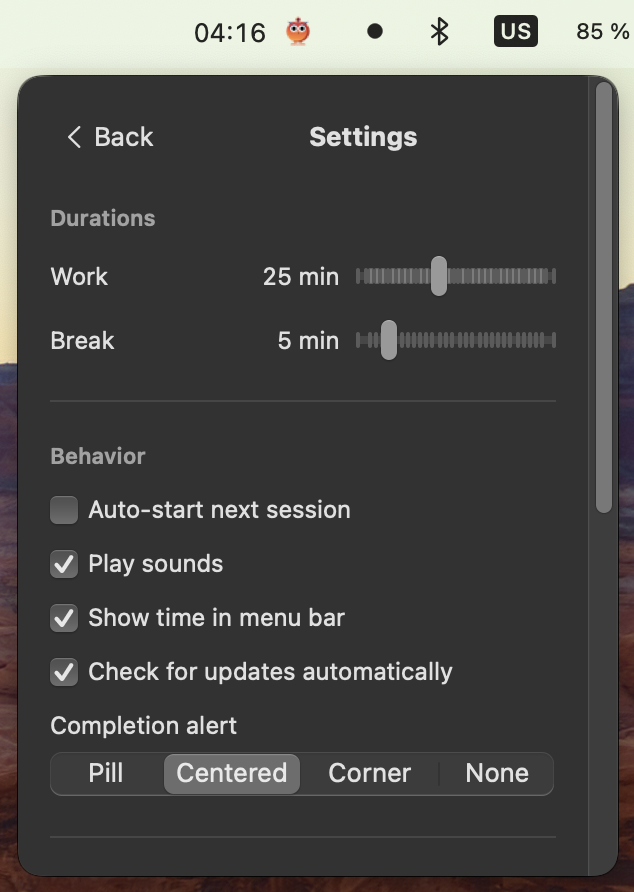

# Pomodorni

A lightweight, native macOS menu bar pomodoro timer. No Electron. No bloat. Just focus.



## Why Pomodorni?

Pomodorni is built entirely in Swift and SwiftUI -- it lives in your menu bar, launches instantly, and feels like it belongs on your Mac.

- **Stays out of your way** -- lives in the menu bar, one click to start
- **Global keyboard shortcuts** -- control your timer without switching windows
- **Three themes** -- Minimal, Glassmorphic, and Bold to match your style
- **Smart nudges** -- detects activity and gently reminds you to take breaks or start sessions
- **Flexible alerts** -- pill, centered, corner, or silent -- your call
- **Auto-updates** -- always up to date, no manual downloads

<p>
  
  
  
</p>

## Install

### Homebrew

```bash
brew tap ornitech/tap
brew install --cask pomodorni
```

### Download

Grab the latest `.dmg` from [Releases](https://github.com/ornitech/pomodorni/releases), open it, and drag Pomodorni to Applications.

### Build from source

```bash
git clone https://github.com/ornitech/pomodorni.git
cd pomodorni
make run
```

Requires macOS 14 (Sonoma) or later.

## How it works

Click the menu bar icon to open the timer. Pick your session, hit start, and get to work. When the session ends, Pomodorni notifies you and optionally starts the next one automatically.



Not at your desk? Pomodorni notices when you come back and nudges you to start a session.



Everything is configurable -- session durations, alert style, sounds, themes, and more. See the full list in [Settings](docs/settings.md).



## Documentation

- [Settings reference](docs/settings.md) -- all configuration options and defaults
- [Keyboard shortcuts](docs/shortcuts.md) -- global hotkeys for hands-free control
- [Architecture](docs/architecture.md) -- how the codebase is structured

## Contributing

1. Fork the repo and create a feature branch
2. Run `make setup` to configure git hooks (pre-commit runs tests, commit-msg enforces conventional commits)
3. Use [conventional commits](https://www.conventionalcommits.org/): `feat:`, `fix:`, `refactor:`, `chore:`, `docs:`, `test:`
4. Make sure `swift test` passes
5. Open a pull request

## License

Copyright 2026 Ornitech. All rights reserved.
